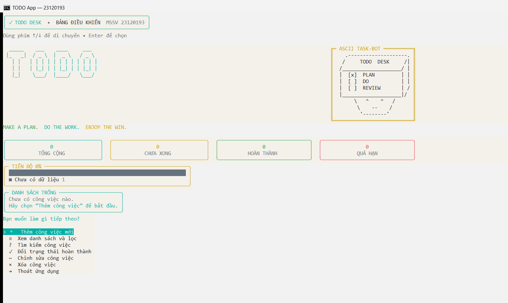
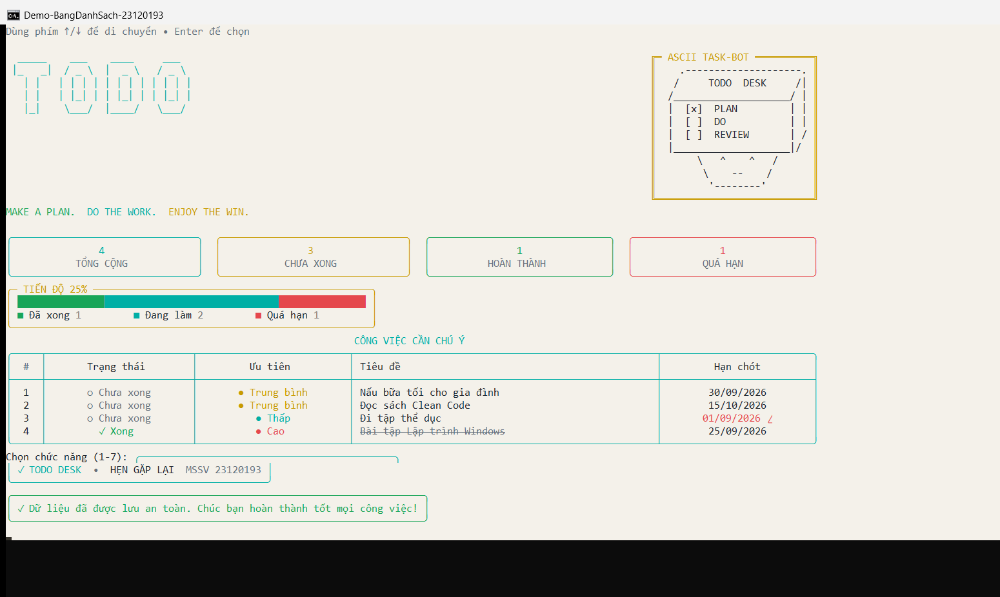

# TODO Desk — Ứng dụng quản lý công việc trên Console

| Thông tin | Nội dung |
|---|---|
| **Môn học** | Lập trình Windows |
| **Mã lớp** | 24/31 |
| **Sinh viên** | Trần Kim Yến |
| **MSSV** | 23120193 |
| **Ngôn ngữ** | C# 14 / .NET 10 |
| **Loại ứng dụng** | Console Application — Terminal User Interface (TUI) |
| **Thư viện giao diện** | Spectre.Console 0.57.2 |
| **Kiểm thử** | xUnit — 17/17 test vượt qua |
| **Mã nguồn** | <https://github.com/liberosis121/todo-app-23120193> (đang để private trước khi nộp) |

---

<a id="muc-luc"></a>

## Mục lục

1. [Giới thiệu](#gioi-thieu)
   - [Chức năng chính](#chuc-nang-chinh)
   - [Ảnh chụp giao diện](#anh-giao-dien)
2. [Cài đặt, chạy và kiểm thử](#cai-dat-chay-test)
   - [Yêu cầu môi trường](#yeu-cau-moi-truong)
   - [Chạy nhanh bằng dotnet CLI](#chay-bang-cli)
   - [Chạy bằng Visual Studio](#chay-bang-visual-studio)
   - [Cách sử dụng ứng dụng](#cach-su-dung)
   - [Chạy toàn bộ unit test](#chay-unit-test)
   - [Chạy từng nhóm test](#chay-tung-test)
   - [Dữ liệu và khôi phục trạng thái](#du-lieu-va-khoi-phuc)
   - [Xử lý lỗi thường gặp](#loi-thuong-gap)
3. [Kiến trúc mã nguồn](#kien-truc)
4. [Các kỹ thuật C# học được](#ky-thuat-csharp)
5. [Kiểm thử và đảm bảo chất lượng](#dam-bao-chat-luong)
6. [Ba điểm cải tiến mã nguồn](#ba-diem-cai-tien)
7. [Các quyết định thiết kế](#quyet-dinh-thiet-ke)
8. [Checklist nghiệm thu](#checklist-nghiem-thu)
9. [Kết luận](#ket-luan)

> Có thể nhấn vào từng mục để chuyển nhanh đến nội dung tương ứng.

---

<a id="gioi-thieu"></a>

## 1. Giới thiệu

**TODO Desk** là ứng dụng quản lý ghi chú công việc chạy trên console. Thay vì chỉ in menu chữ và yêu cầu người dùng nhập số, chương trình sử dụng **Terminal User Interface (TUI)** để tạo trải nghiệm gần giống một ứng dụng desktop ngay trong terminal:

- menu tương tác bằng phím **↑ / ↓ / Enter**;
- light theme nền ngà với bảng màu teal, green, gold và coral;
- logo Figlet cỡ lớn và ASCII Task-Bot được vẽ hoàn toàn bằng ký tự terminal;
- dashboard gồm các thẻ thống kê Tổng cộng, Chưa xong, Hoàn thành và Quá hạn;
- biểu đồ tiến độ theo tỷ lệ phần trăm;
- bảng dữ liệu có viền, màu sắc, căn cột và trạng thái trực quan;
- mỗi chức năng có màn hình/form riêng;
- giao diện được làm mới sau thao tác thay vì nối output thành một danh sách dài;
- dữ liệu tự động lưu ra JSON và được nạp lại ở lần chạy sau.

Ứng dụng vẫn tuân thủ yêu cầu **chạy trên console**, không chuyển sang WinForms/WPF. Spectre.Console chỉ làm đẹp terminal và không thay đổi bản chất của loại project.

<a id="chuc-nang-chinh"></a>

### 1.1. Chức năng chính

| # | Chức năng | Chi tiết |
|---:|---|---|
| 1 | Thêm công việc | Nhập tiêu đề, mô tả, mức ưu tiên và ngày hết hạn |
| 2 | Xem danh sách | Hiển thị bảng đầy đủ trạng thái, ưu tiên, tiêu đề, hạn chót và mô tả |
| 3 | Lọc dữ liệu | Tất cả / Chưa hoàn thành / Đã hoàn thành / Quá hạn |
| 4 | Tìm kiếm | Tìm trong tiêu đề và mô tả, không phân biệt chữ hoa–thường |
| 5 | Đổi trạng thái | Chuyển qua lại giữa Chưa xong ↔ Đã xong |
| 6 | Chỉnh sửa | Thay đổi tiêu đề, mô tả, mức ưu tiên và hạn chót |
| 7 | Xóa | Chọn task và xác nhận trước khi xóa |
| 8 | Lưu bền vững | Tự lưu JSON sau mỗi thay đổi và nạp dữ liệu khi khởi động |
| 9 | Xử lý quá hạn | Tự tính theo ngày hiện tại; không xem task đã hoàn thành là quá hạn |
| 10 | Thoát an toàn | Hỗ trợ Ctrl+C, cancellation và lưu dữ liệu trong `finally` |

<a id="anh-giao-dien"></a>

### 1.2. Ảnh chụp giao diện thực tế

**Dashboard và menu tương tác bằng phím ↑/↓/Enter:**



**Bảng công việc, thống kê và biểu đồ tiến độ:**



Trong ảnh thứ hai:

- task hoàn thành được hiển thị màu xanh và gạch ngang;
- task quá hạn có ngày màu đỏ kèm ký hiệu cảnh báo;
- mức ưu tiên Cao / Trung bình / Thấp có màu riêng;
- dashboard hiển thị 4 task, 1 task hoàn thành, 3 task chưa xong và 1 task quá hạn;
- biểu đồ tiến độ hiển thị 25% hoàn thành.

---

<a id="cai-dat-chay-test"></a>

## 2. Cài đặt, chạy và kiểm thử dự án

> Tất cả lệnh trong mục này phải được thực hiện tại **thư mục gốc của project** — nơi chứa file `TodoApp.sln`.

<a id="yeu-cau-moi-truong"></a>

### 2.1. Yêu cầu môi trường

- Windows 10 hoặc Windows 11;
- [.NET SDK 10.0](https://dotnet.microsoft.com/download) trở lên;
- Visual Studio có workload **.NET Desktop Development** nếu chạy bằng IDE;
- terminal hỗ trợ UTF-8, khuyến nghị Windows Terminal.

Kiểm tra .NET SDK đã được cài:

```powershell
dotnet --version
```

Kết quả phải hiển thị phiên bản `10.0.x` hoặc mới hơn, ví dụ:

```text
10.0.401
```

Nếu lệnh `dotnet` không tồn tại, cần cài .NET SDK rồi mở lại terminal.

<a id="chay-bang-cli"></a>

### 2.2. Chạy nhanh bằng dotnet CLI

**Bước 1 — giải nén và chuyển vào thư mục project:**

```powershell
cd "duong-dan-den-thu-muc-da-giai-nen"
```

**Bước 2 — tải các NuGet package:**

```powershell
dotnet restore TodoApp.sln
```

Lệnh này tải Spectre.Console, xUnit và các package phục vụ test được khai báo trong `.csproj`.

**Bước 3 — build toàn bộ solution:**

```powershell
dotnet build TodoApp.sln
```

Build thành công phải kết thúc bằng:

```text
Build succeeded.
    0 Warning(s)
    0 Error(s)
```

**Bước 4 — chạy ứng dụng:**

```powershell
dotnet run --project src/TodoApp/TodoApp.csproj
```

Có thể dùng dạng rút gọn tương đương:

```powershell
dotnet run --project src/TodoApp
```

Để chạy nhanh sau khi đã build và không build lại:

```powershell
dotnet run --project src/TodoApp --no-build
```

<a id="chay-bang-visual-studio"></a>

### 2.3. Chạy bằng Visual Studio

1. Khởi động Visual Studio.
2. Chọn **Open a project or solution**.
3. Mở file `TodoApp.sln` ở thư mục gốc.
4. Trong **Solution Explorer**, nhấp phải project `TodoApp`.
5. Chọn **Set as Startup Project** nếu `TodoApp` chưa được in đậm.
6. Chờ Visual Studio restore NuGet package hoàn tất.
7. Nhấn **Ctrl+F5** để chạy không debug, hoặc **F5** để chạy với debugger.

Nếu Visual Studio hỏi chọn startup project, cần chọn project trong thư mục `src/TodoApp`, không chọn `TodoApp.Tests`.

<a id="cach-su-dung"></a>

### 2.4. Cách sử dụng ứng dụng

| Thao tác | Phím sử dụng |
|---|---|
| Di chuyển giữa các lựa chọn | `↑` / `↓` |
| Xác nhận lựa chọn | `Enter` |
| Nhập nội dung form | Gõ nội dung rồi nhấn `Enter` |
| Bỏ qua trường tùy chọn | Chỉ nhấn `Enter` |
| Giữ giá trị cũ khi chỉnh sửa | Chỉ nhấn `Enter` |
| Xác nhận xóa | Chọn Yes/No bằng phím điều hướng rồi `Enter` |
| Dừng ứng dụng khẩn cấp | `Ctrl+C` — chương trình vẫn cố gắng lưu dữ liệu |

Quy trình thử nhanh đề xuất:

1. Chọn **Thêm công việc mới**.
2. Nhập tiêu đề, mô tả, priority và deadline.
3. Quay lại dashboard và kiểm tra các thẻ thống kê.
4. Chọn **Đổi trạng thái hoàn thành**.
5. Chọn **Xem danh sách và lọc** để kiểm tra trạng thái mới.
6. Thoát rồi chạy lại ứng dụng để xác nhận dữ liệu vẫn còn.

<a id="chay-unit-test"></a>

### 2.5. Chạy toàn bộ unit test

Từ thư mục chứa `TodoApp.sln`, chạy:

```powershell
dotnet test TodoApp.sln
```

Lệnh trên sẽ:

1. restore package nếu cần;
2. build project ứng dụng và project test;
3. chạy toàn bộ test trong `TodoApp.Tests`;
4. tổng hợp số test pass/fail/skip.

Kết quả mong đợi:

```text
Passed! - Failed: 0, Passed: 17, Skipped: 0, Total: 17
```

Để test nhanh sau khi vừa build thành công:

```powershell
dotnet test TodoApp.sln --no-build
```

Để hiển thị log chi tiết hơn:

```powershell
dotnet test TodoApp.sln --logger "console;verbosity=detailed"
```

**Chạy test bằng Visual Studio:**

1. mở menu **Test → Test Explorer**;
2. chọn **Run All Tests**;
3. kiểm tra Test Explorer hiển thị 17 test màu xanh;
4. có thể nhấp phải một test và chọn **Debug** để đặt breakpoint.

<a id="chay-tung-test"></a>

### 2.6. Chạy từng nhóm hoặc từng test

Chỉ chạy test nghiệp vụ `TaskServiceTests`:

```powershell
dotnet test TodoApp.sln --filter "FullyQualifiedName~TaskServiceTests"
```

Chỉ chạy test repository JSON:

```powershell
dotnet test TodoApp.sln --filter "FullyQualifiedName~JsonTaskRepositoryTests"
```

Chạy một test cụ thể:

```powershell
dotnet test TodoApp.sln --filter "FullyQualifiedName~AddAsync_AppendsItem_AndPersists"
```

<a id="du-lieu-va-khoi-phuc"></a>

### 2.7. Dữ liệu và khôi phục trạng thái

Khi chạy Debug, dữ liệu được lưu tại:

```text
src/TodoApp/bin/Debug/net10.0/todo.data.json
```

Khi publish, file nằm cùng thư mục với executable. File được tạo tự động sau lần thay đổi dữ liệu đầu tiên.

**Reset ứng dụng về danh sách trống:**

1. đóng chương trình;
2. xóa file `todo.data.json` ở đường dẫn trên;
3. chạy lại ứng dụng.

Không cần sửa source code và không cần tạo file JSON rỗng. Nếu file chưa tồn tại, repository tự trả về danh sách rỗng.

**Build sạch lại toàn bộ solution:**

```powershell
dotnet clean TodoApp.sln
dotnet restore TodoApp.sln
dotnet build TodoApp.sln
```

<a id="loi-thuong-gap"></a>

### 2.8. Xử lý lỗi thường gặp

| Lỗi | Nguyên nhân thường gặp | Cách xử lý |
|---|---|---|
| `'dotnet' is not recognized` | Chưa cài SDK hoặc PATH chưa cập nhật | Cài .NET SDK 10 rồi mở lại terminal |
| Không restore được Spectre.Console/xUnit | Mất mạng hoặc NuGet bị chặn | Kiểm tra mạng, chạy lại `dotnet restore` |
| Build báo SDK không hỗ trợ `net10.0` | SDK đang dùng quá cũ | Chạy `dotnet --list-sdks` và cài SDK 10 |
| Visual Studio chạy project test | Chọn sai Startup Project | Set `src/TodoApp` làm Startup Project |
| Chữ tiếng Việt/ký hiệu hiển thị sai | Terminal/font không hỗ trợ UTF-8 | Dùng Windows Terminal và font Cascadia Mono/Consolas |
| Muốn xóa dữ liệu demo | File JSON cũ vẫn được nạp | Đóng app rồi xóa `todo.data.json` |
| Test không chạy do file đang bị khóa | App hoặc test cũ chưa tắt | Đóng process `TodoApp`, chạy `dotnet clean`, test lại |

Sau khi xử lý, xác minh toàn bộ bằng:

```powershell
dotnet build TodoApp.sln
dotnet test TodoApp.sln --no-build
```

---

<a id="kien-truc"></a>

## 3. Kiến trúc mã nguồn

### 3.1. Tổ chức theo trách nhiệm

```text
┌──────────────────────────────────────────────────────┐
│ Presentation / UI                                   │
│ MainMenu, ConsoleUi                                 │
│ Điều hướng màn hình, TUI, bảng, panel, prompt       │
├──────────────────────────────────────────────────────┤
│ Application / Business                              │
│ ITaskService, TaskService                           │
│ Thêm, sửa, xóa, toggle, tìm kiếm, lọc               │
├──────────────────────────────────────────────────────┤
│ Data Access                                         │
│ ITaskRepository, JsonTaskRepository                 │
│ Serialize, deserialize, file I/O, atomic write      │
├──────────────────────────────────────────────────────┤
│ Domain / Model                                      │
│ TaskItem, TaskPriority, TaskFilter                  │
│ Dữ liệu và quy tắc trạng thái/quá hạn               │
├──────────────────────────────────────────────────────┤
│ Cross-cutting Utilities                             │
│ InputValidator, ConsoleInput, StringExtensions      │
│ Validate, chuẩn hóa chuỗi, xử lý EOF                │
└──────────────────────────────────────────────────────┘
                         ▲
             Program.cs — Composition Root
```

Luồng xử lý của một thao tác:

```text
Người dùng
   ↓
MainMenu / ConsoleUi
   ↓ gọi interface
ITaskService → TaskService
   ↓ gọi interface
ITaskRepository → JsonTaskRepository
   ↓
todo.data.json
```

Tầng `TaskService` **không biết** Spectre.Console, `Console.ReadLine()` hay JSON. Nhờ vậy nghiệp vụ có thể được test bằng repository giả lập trong bộ nhớ.

### 3.2. Cấu trúc thư mục

```text
TODO App/
├── TodoApp.sln
├── readme.md
├── docs/
│   ├── demo-01-start.png
│   └── demo-02-table.png
├── src/TodoApp/
│   ├── Program.cs
│   ├── TodoApp.csproj
│   ├── Models/
│   │   └── TaskItem.cs
│   ├── Data/
│   │   ├── ITaskRepository.cs
│   │   └── JsonTaskRepository.cs
│   ├── Services/
│   │   ├── ITaskService.cs
│   │   └── TaskService.cs
│   ├── UI/
│   │   ├── ConsoleUi.cs
│   │   ├── LightThemeTextWriter.cs # Giữ nền sáng sau ANSI reset
│   │   └── MainMenu.cs
│   └── Utils/
│       ├── ConsoleInput.cs
│       └── InputValidator.cs
└── tests/TodoApp.Tests/
    ├── Fakes/
    │   └── InMemoryTaskRepository.cs
    ├── TaskServiceTests.cs
    └── JsonTaskRepositoryTests.cs
```

### 3.3. Bảng truy vết yêu cầu → mã nguồn

| Yêu cầu | Thành phần thực hiện |
|---|---|
| App TODO chạy trên console | `Program.cs`, `UI/MainMenu.cs` |
| Giao diện dashboard/TUI | `UI/ConsoleUi.Dashboard()`, `BeginView()`, `MainMenu()` |
| Thêm task | `MainMenu.AddTaskAsync()` → `TaskService.AddAsync()` |
| Hiển thị task | `ConsoleUi.RenderTasks()` |
| Đánh dấu hoàn thành | `MainMenu.ToggleTaskAsync()` → `TaskService.ToggleDoneAsync()` |
| Chỉnh sửa | `MainMenu.EditTaskAsync()` → `TaskService.UpdateAsync()` |
| Xóa có xác nhận | `MainMenu.RemoveTaskAsync()` → `ConsoleUi.Confirm()` → `TaskService.RemoveAsync()` |
| Tìm kiếm | `TaskService.Search()` dùng LINQ |
| Lọc trạng thái | `TaskService.Filter()` dùng switch expression |
| Kiểm tra quá hạn | `TaskItem.IsOverdue()` |
| Lưu và đọc JSON | `JsonTaskRepository.SaveAsync()` / `LoadAsync()` |
| Validate input | `InputValidator.cs` |
| Xử lý hết stream nhập | `ConsoleInput.cs` |
| Unit test | `tests/TodoApp.Tests/` |

---

<a id="ky-thuat-csharp"></a>

## 4. Tổng kết chi tiết các kỹ thuật C# học được

> Đây là phần tổng kết kiến thức rút ra trực tiếp từ mã nguồn, không chỉ liệt kê tên kỹ thuật.

### 4.1. Lập trình hướng đối tượng và mô hình hóa domain

`TaskItem` biểu diễn một công việc trong hệ thống. Mỗi object chứa cả dữ liệu và hành vi liên quan trực tiếp đến dữ liệu đó:

```csharp
public sealed class TaskItem
{
    public Guid Id { get; set; } = Guid.NewGuid();
    public string Title { get; set; } = string.Empty;
    public TaskPriority Priority { get; set; }
    public DateOnly? DueDate { get; set; }
    public bool IsDone { get; set; }

    public bool IsOverdue(DateTime? today = null)
    {
        if (IsDone || DueDate is null) return false;
        return DueDate.Value.ToDateTime(TimeOnly.MinValue) < (today ?? DateTime.Today).Date;
    }
}
```

**Kiến thức học được:**

- class dùng để gom trạng thái và hành vi thành một đơn vị;
- `sealed` thể hiện chủ đích không cho kế thừa tùy ý;
- giá trị mặc định giúp object luôn ở trạng thái hợp lệ cơ bản;
- quy tắc “task đã hoàn thành thì không còn quá hạn” nằm trong model thay vì bị lặp ở UI;
- method nhận `today` tùy chọn giúp logic thời gian dễ kiểm thử hơn.

### 4.2. Enum và switch expression

Mức ưu tiên và trạng thái lọc là tập giá trị hữu hạn, nên được biểu diễn bằng `enum` thay vì string:

```csharp
public enum TaskPriority { Low, Medium, High }
public enum TaskFilter { All, Active, Done, Overdue }
```

Lọc dữ liệu sử dụng switch expression:

```csharp
public IReadOnlyList<TaskItem> Filter(TaskFilter filter) => filter switch
{
    TaskFilter.Active  => _items.Where(t => !t.IsDone).ToList(),
    TaskFilter.Done    => _items.Where(t => t.IsDone).ToList(),
    TaskFilter.Overdue => _items.Where(t => t.IsOverdue()).ToList(),
    _                  => _items.ToList()
};
```

**Kiến thức học được:** enum an toàn kiểu hơn string, tránh lỗi gõ sai như `"Hight"`; switch expression ngắn gọn, buộc từng nhánh trả về cùng kiểu và dễ mở rộng.

### 4.3. Interface và Dependency Inversion Principle

`TaskService` không phụ thuộc trực tiếp vào `JsonTaskRepository`. Nó chỉ phụ thuộc vào hợp đồng:

```csharp
public interface ITaskRepository
{
    Task<IReadOnlyList<TaskItem>> LoadAsync(CancellationToken ct = default);
    Task SaveAsync(IReadOnlyList<TaskItem> items, CancellationToken ct = default);
}

public sealed class TaskService : ITaskService
{
    private readonly ITaskRepository _repository;

    public TaskService(ITaskRepository repository)
        => _repository = repository
            ?? throw new ArgumentNullException(nameof(repository));
}
```

**Kiến thức học được:**

- interface mô tả **điều đối tượng làm được**, không mô tả chi tiết cách làm;
- tầng nghiệp vụ phụ thuộc abstraction, không phụ thuộc file JSON cụ thể;
- có thể thay JSON bằng SQLite, SQL Server hoặc API mà không sửa thuật toán tìm/lọc;
- trong unit test có thể tiêm `InMemoryTaskRepository`, giúp test chạy nhanh và độc lập file system.

Đây là cách áp dụng thực tế chữ **D** trong SOLID — Dependency Inversion.

### 4.4. Constructor Injection và Composition Root

Các phụ thuộc được truyền vào constructor thay vì tạo bằng `new` bên trong service:

```csharp
ITaskRepository repository = new JsonTaskRepository();
ITaskService service = new TaskService(repository);
var menu = new MainMenu(service);
```

Toàn bộ việc nối object nằm trong `Program.cs`, còn gọi là **Composition Root**.

**Kiến thức học được:**

- dễ nhìn thấy dependency graph;
- giảm coupling;
- test có thể thay implementation;
- tránh Service Locator và biến static toàn cục;
- khi project lớn hơn có thể chuyển sang DI container mà không đổi thiết kế các lớp.

### 4.5. Separation of Concerns và kiến trúc phân tầng

Mỗi lớp có một lý do thay đổi:

| Lớp | Trách nhiệm |
|---|---|
| `TaskItem` | Dữ liệu và quy tắc trạng thái |
| `TaskService` | Nghiệp vụ CRUD, tìm kiếm, lọc |
| `JsonTaskRepository` | Đọc/ghi JSON |
| `ConsoleUi` | Render dashboard, bảng, màu, prompt |
| `MainMenu` | Điều hướng và phối hợp use case |
| `InputValidator` | Kiểm tra input |

**Kiến thức học được:** không đặt toàn bộ code trong `Program.cs`. Việc tách trách nhiệm giúp đọc code nhanh hơn, giảm ảnh hưởng khi thay đổi và cho phép test từng phần.

### 4.6. Generic collections và chỉ đọc dữ liệu

Dữ liệu nội bộ dùng `List<TaskItem>`, nhưng service chỉ công khai `IReadOnlyList<TaskItem>`:

```csharp
private readonly List<TaskItem> _items = new();
public IReadOnlyList<TaskItem> Items => _items;
```

**Kiến thức học được:**

- `List<T>` cung cấp collection mạnh và an toàn kiểu;
- generic tránh ép kiểu từ `object`;
- `IReadOnlyList<T>` giới hạn quyền của caller: UI có thể đọc nhưng không thể gọi `Add`/`Remove` trực tiếp;
- mọi thay đổi phải đi qua service, nên luôn chạy nghiệp vụ và lưu file đúng quy trình.

### 4.7. LINQ để truy vấn collection

Tìm kiếm, sắp xếp và thống kê được viết theo dạng pipeline:

```csharp
return _items
    .Where(t => t.Title.ToLowerInvariant().Contains(key)
             || t.Description.ToLowerInvariant().Contains(key))
    .OrderBy(t => t.IsDone)
    .ThenByDescending(t => t.Priority)
    .ToList();
```

Dashboard cũng dùng `Count`, `OrderBy`, `ThenBy`, `Take`.

**Kiến thức học được:**

- `Where` lọc dữ liệu;
- `OrderBy` và `ThenBy` sắp xếp nhiều cấp;
- `FirstOrDefault` trả về `null` nếu không tìm thấy;
- `Take` giới hạn danh sách preview;
- LINQ mô tả “muốn dữ liệu gì” rõ hơn vòng `for` thủ công.

### 4.8. async/await và I/O bất đồng bộ

Repository đọc/ghi JSON bằng API bất đồng bộ:

```csharp
await using var stream = File.OpenRead(_path);
var items = await JsonSerializer.DeserializeAsync<List<TaskItem>>(
    stream, Options, ct);
```

Service chờ lưu hoàn tất trước khi trả kết quả:

```csharp
_items.Add(item);
await PersistAsync();
return item;
```

**Kiến thức học được:**

- `Task` đại diện cho một thao tác chưa hoàn tất;
- `Task<T>` trả về kết quả bất đồng bộ;
- `await` không khóa thread trong thời gian chờ I/O;
- async nên được truyền xuyên suốt call chain, không dùng `.Result`/`.Wait()`;
- không dùng “fire-and-forget” cho thao tác lưu quan trọng vì có thể mất dữ liệu hoặc nuốt exception.

### 4.9. CancellationToken và xử lý Ctrl+C

```csharp
using var cts = new CancellationTokenSource();
Console.CancelKeyPress += (_, e) =>
{
    e.Cancel = true;
    cts.Cancel();
};
```

Token được truyền vào khâu khởi tạo và repository. `OperationCanceledException` được xử lý riêng.

**Kiến thức học được:** cancellation là cơ chế hủy **hợp tác**. Code không bị kill đột ngột mà nhận tín hiệu, dừng ở điểm an toàn và chạy cleanup.

### 4.10. try/catch/finally và exception filter

Repository chỉ bắt những lỗi mà nó biết cách phục hồi:

```csharp
catch (Exception ex) when (
    ex is JsonException or IOException or UnauthorizedAccessException)
{
    Console.WriteLine("Không đọc được file dữ liệu...");
    return Array.Empty<TaskItem>();
}
```

`Program.cs` luôn thử lưu trong `finally`:

```csharp
finally
{
    await repository.SaveAsync(service.Items, CancellationToken.None);
}
```

**Kiến thức học được:**

- không nên `catch (Exception) { }` rồi bỏ qua lỗi;
- exception filter giúp bắt đúng nhóm có thể xử lý;
- `finally` chạy cả khi thành công, lỗi hoặc cancellation;
- lỗi kỹ thuật được chuyển thành thông báo dễ hiểu thay vì làm app crash với stack trace.

### 4.11. System.Text.Json và cấu hình serialization

```csharp
private static readonly JsonSerializerOptions Options = new()
{
    WriteIndented = true,
    PropertyNamingPolicy = JsonNamingPolicy.CamelCase,
    Converters = { new JsonStringEnumConverter() },
    DefaultIgnoreCondition = JsonIgnoreCondition.WhenWritingNull
};
```

**Kiến thức học được:**

- serialize chuyển object thành JSON; deserialize thực hiện chiều ngược lại;
- camelCase phù hợp quy ước JSON;
- enum dạng chuỗi (`"High"`) dễ đọc hơn số (`2`);
- `JsonIgnore` loại thuộc tính tính toán khỏi file;
- `WriteIndented` giúp dễ kiểm tra dữ liệu trong bài học.

### 4.12. Ghi file atomic để giảm nguy cơ hỏng dữ liệu

Chương trình không ghi trực tiếp đè lên file chính:

```csharp
var temp = _path + ".tmp";
await using (var stream = File.Create(temp))
{
    await JsonSerializer.SerializeAsync(stream, items, Options, ct);
}
File.Move(temp, _path, overwrite: true);
```

**Kiến thức học được:** nếu tiến trình bị dừng giữa lúc serialize, file chính cũ vẫn còn nguyên. Chỉ sau khi ghi file tạm thành công mới thay file chính. Đây là kỹ thuật **write-temp-then-replace**.

### 4.13. Nullable Reference Types

Project bật:

```xml
<Nullable>enable</Nullable>
```

Các giá trị tùy chọn được biểu diễn rõ bằng `string?`, `DateOnly?`, `TaskItem?`.

**Kiến thức học được:** compiler phân tích null tại thời điểm build, buộc lập trình viên xử lý trường hợp không có giá trị và giảm `NullReferenceException` lúc chạy.

### 4.14. Extension methods và chuẩn hóa input

```csharp
public static string OneLine(this string? text)
    => (text ?? string.Empty).Trim();

public static int Length0(this string? text)
    => text.OneLine().Length;
```

**Kiến thức học được:** từ khóa `this` ở tham số đầu tạo cú pháp gọi tự nhiên như `value.OneLine()`. Logic null + trim chỉ viết một lần và dùng nhất quán.

### 4.15. Kiểu dữ liệu phù hợp: Guid, DateOnly và DateTime

- `Guid` tạo mã định danh không phụ thuộc thứ tự hiển thị;
- `DateOnly` phù hợp hạn công việc vì không cần giờ/phút/múi giờ;
- `DateTime` phù hợp `CreatedAt` và `UpdatedAt` vì cần thời điểm chính xác.

**Kiến thức học được:** chọn đúng kiểu giúp code tự mô tả và tránh lỗi. Không nên lưu tất cả dưới dạng string.

### 4.16. Pattern matching và biểu thức hiện đại của C#

Mã nguồn sử dụng:

```csharp
return answer is "y" or "yes";
```

và:

```csharp
priority switch
{
    TaskPriority.High => "Cao",
    TaskPriority.Low  => "Thấp",
    _                 => "Trung bình"
};
```

**Kiến thức học được:** pattern matching và switch expression giúp code ngắn nhưng vẫn rõ, thay cho nhiều khối `if/else`.

### 4.17. Top-level statements, event và using declaration

`Program.cs` sử dụng top-level statements; compiler tự tạo entry point. Sự kiện `Console.CancelKeyPress` xử lý Ctrl+C. `using var` tự giải phóng `CancellationTokenSource`.

**Kiến thức học được:**

- top-level statements phù hợp app nhỏ và composition root;
- event cho phép phản ứng với hành động hệ thống;
- `IDisposable` và `using` giúp giải phóng tài nguyên xác định, không chờ garbage collector.

### 4.18. TUI với Spectre.Console

Ứng dụng sử dụng:

- `Panel` cho header, card và form;
- `Table` cho dữ liệu có cột;
- `SelectionPrompt<T>` cho menu phím mũi tên;
- `BreakdownChart` cho tiến độ;
- `FigletText` cho logo lớn kiểu game terminal;
- `Markup` và `Style` cho màu;
- `AnsiConsole.Clear()` để refresh màn hình;
- `Markup.Escape()` để nội dung người dùng không phá cú pháp markup.

**Kiến thức học được:** console vẫn có thể có kiến trúc giao diện gồm view, component, theme và interaction. Quan trọng nhất là dữ liệu người dùng phải được escape trước khi render.

Light theme còn gặp một vấn đề kỹ thuật riêng: mã ANSI `SGR 0` do thư viện phát ra có thể đưa Windows Console Host cũ về nền đen. `LightThemeTextWriter` được viết theo **Decorator pattern** để bọc `stdout`, nhận diện ANSI reset và khôi phục foreground/background mặc định mà không ghi đè màu teal/gold/coral của component. Nhờ đó giao diện nền sáng nhất quán trên cả Windows Terminal mới và Console Host cũ.

Chương trình còn có fallback nhập số khi `Console.IsInputRedirected`, nhờ vậy giao diện tương tác không làm hỏng automated test hoặc kịch bản E2E.

### 4.19. Defensive programming với input và EOF

`InputValidator` lặp lại nếu số/ngày không hợp lệ. `ConsoleInput` phát hiện `Console.ReadLine()` trả về `null` khi stream kết thúc.

**Kiến thức học được:** input là dữ liệu không đáng tin cậy. Chương trình phải xử lý chuỗi rỗng, sai kiểu, ngày sai định dạng và EOF; nếu không, menu có thể quay vô hạn khi chạy bằng pipe.

### 4.20. Unit test, Fake Object và Arrange–Act–Assert

`TaskServiceTests` dùng repository trong bộ nhớ:

```csharp
private readonly InMemoryTaskRepository _repo = new();
private readonly TaskService _service;

public TaskServiceTests()
    => _service = new TaskService(_repo);
```

Mỗi test có ba phần:

1. **Arrange:** chuẩn bị service và dữ liệu;
2. **Act:** gọi method cần test;
3. **Assert:** kiểm tra kết quả và side effect.

`JsonTaskRepositoryTests` dùng file tạm thật và xóa trong `Dispose()`.

**Kiến thức học được:**

- unit test phải nhanh, độc lập và lặp lại được;
- fake repository tránh phụ thuộc file system trong test nghiệp vụ;
- integration-style test repository kiểm tra serialize thật;
- test cả happy path và edge case: ID không tồn tại, file chưa có, file JSON hỏng, task đã xong không được tính quá hạn;
- test giúp refactor UI mạnh mà vẫn biết tầng nghiệp vụ không bị phá.

---

<a id="dam-bao-chat-luong"></a>

## 5. Kiểm thử và đảm bảo chất lượng

### 5.1. Phạm vi 17 unit test

| Test suite | Số test | Nội dung |
|---|---:|---|
| `TaskServiceTests` | 12 | Thêm, trim input, thứ tự thêm, toggle hai lần, ID không tồn tại, cập nhật, xóa, tìm kiếm, lọc, quá hạn, load repository |
| `JsonTaskRepositoryTests` | 5 | File chưa tồn tại, round-trip đủ field, enum dạng string, JSON hỏng không crash, ghi đè dữ liệu |
| **Tổng** | **17** | **17 passed, 0 failed** |

### 5.2. Các tình huống biên đã xử lý

| Tình huống | Hành vi chương trình |
|---|---|
| Tiêu đề trống | Yêu cầu nhập lại |
| Ngày không đúng định dạng | Báo ví dụ hợp lệ và yêu cầu nhập lại |
| Chọn số ngoài khoảng | Yêu cầu nhập lại |
| Danh sách rỗng mà chọn sửa/xóa/toggle | Hiển thị thông báo, không crash |
| Xóa task | Yêu cầu xác nhận |
| JSON không tồn tại | Khởi tạo danh sách rỗng |
| JSON bị hỏng | Cảnh báo và không làm app crash |
| Ctrl+C | Phát cancellation và chạy `finally` |
| Hết stream stdin | Thoát sạch, không vòng lặp vô hạn |
| Tiêu đề có ký tự markup `[]` | Dùng `Markup.Escape()` trước khi hiển thị |
| Task hoàn thành nhưng ngày cũ | Không tính là quá hạn |

---

<a id="ba-diem-cai-tien"></a>

## 6. Ba điểm cải tiến giúp mã nguồn có chất lượng cao hơn

> Ba cải tiến dưới đây tập trung vào **chất lượng kiến trúc và độ tin cậy**, không chỉ thêm tính năng bề mặt. Mỗi điểm gồm hiện trạng, vấn đề, giải pháp, kế hoạch triển khai và lợi ích.

### Cải tiến 1 — Dùng Generic Host + Dependency Injection container + cấu hình và logging

#### Hiện trạng

`Program.cs` đang thực hiện dependency injection thủ công:

```csharp
ITaskRepository repository = new JsonTaskRepository();
ITaskService service = new TaskService(repository);
var menu = new MainMenu(service);
```

Cách này rõ ràng và phù hợp project nhỏ. Tuy nhiên, khi có thêm nhiều service như settings, export, reminder, logging hoặc database, `Program.cs` sẽ phải quản lý ngày càng nhiều object và thứ tự khởi tạo.

#### Giải pháp đề xuất

Sử dụng `Microsoft.Extensions.Hosting` và `Microsoft.Extensions.DependencyInjection`:

```csharp
var builder = Host.CreateApplicationBuilder(args);

builder.Services.AddSingleton<ITaskRepository, JsonTaskRepository>();
builder.Services.AddSingleton<ITaskService, TaskService>();
builder.Services.AddSingleton<MainMenu>();

builder.Services.AddOptions<TodoOptions>()
    .BindConfiguration("Todo");

builder.Logging.AddConsole();

using var host = builder.Build();
await host.Services.GetRequiredService<MainMenu>().RunAsync();
```

#### Các bước triển khai

1. thêm package Hosting/DependencyInjection;
2. đưa đường dẫn dữ liệu, theme và số dòng dashboard vào `appsettings.json`;
3. inject `IOptions<TodoOptions>` vào repository/UI;
4. inject `ILogger<T>` thay cho `Console.WriteLine` trong data layer;
5. để container quản lý vòng đời singleton/transient và `IDisposable`;
6. thêm environment `Development` / `Production` nếu cần.

#### Lợi ích

- composition root ngắn và dễ mở rộng;
- đổi implementation ở một nơi;
- lifecycle của object được quản lý chuẩn;
- log có level, timestamp và category;
- cấu hình tách khỏi code;
- thuận lợi chuyển app thành Worker Service, API hoặc WinForms trong tương lai.

#### Đánh đổi

- thêm package và khái niệm framework;
- với project rất nhỏ, DI thủ công hiện tại dễ hiểu hơn;
- cần tránh lạm dụng DI cho object chỉ là model dữ liệu.

---

### Cải tiến 2 — Thay JSON bằng SQLite, thêm transaction và optimistic concurrency

#### Hiện trạng

Repository hiện lưu toàn bộ danh sách vào một file JSON sau mỗi thay đổi. Atomic write giúp giảm nguy cơ file hỏng, nhưng vẫn có các giới hạn:

- mỗi thao tác serialize lại toàn bộ danh sách;
- không tối ưu khi có hàng nghìn task;
- hai tiến trình mở cùng lúc có thể ghi đè dữ liệu của nhau;
- truy vấn vẫn phải load toàn bộ vào RAM;
- chưa có transaction nhiều thao tác.

#### Giải pháp đề xuất

Tạo thêm `SqliteTaskRepository` triển khai cùng `ITaskRepository`, hoặc mở rộng interface thành CRUD repository:

```csharp
public interface ITaskRepository
{
    Task<IReadOnlyList<TaskItem>> GetAllAsync(CancellationToken ct);
    Task<TaskItem?> GetByIdAsync(Guid id, CancellationToken ct);
    Task AddAsync(TaskItem item, CancellationToken ct);
    Task UpdateAsync(TaskItem item, CancellationToken ct);
    Task DeleteAsync(Guid id, CancellationToken ct);
}
```

Schema gợi ý:

```sql
CREATE TABLE Tasks (
    Id TEXT PRIMARY KEY,
    Title TEXT NOT NULL,
    Description TEXT NOT NULL,
    Priority INTEGER NOT NULL,
    DueDate TEXT NULL,
    IsDone INTEGER NOT NULL,
    CreatedAt TEXT NOT NULL,
    UpdatedAt TEXT NOT NULL,
    Version INTEGER NOT NULL DEFAULT 1
);
```

#### Các bước triển khai

1. thêm `Microsoft.Data.Sqlite` hoặc Entity Framework Core SQLite;
2. tạo migration/schema version;
3. tạo index cho `IsDone`, `DueDate`, `Priority`;
4. dùng transaction cho nhóm thay đổi;
5. thêm cột `Version` để optimistic concurrency;
6. khi update: `WHERE Id = @id AND Version = @oldVersion`;
7. nếu số row cập nhật bằng 0, báo xung đột thay vì ghi đè im lặng;
8. giữ `JsonTaskRepository` làm tùy chọn export/backup.

#### Lợi ích

- hiệu năng tốt hơn với dữ liệu lớn;
- chỉ ghi row thay đổi;
- truy vấn/lọc có thể chạy ở database;
- transaction đảm bảo tính nhất quán;
- phát hiện hai tiến trình sửa cùng task;
- dễ thêm thống kê, lịch sử hoặc nhiều danh sách.

#### Đánh đổi

- phức tạp hơn JSON;
- cần migration và quản lý schema;
- backup không còn đơn giản như copy một file văn bản;
- phải test thêm lỗi database, transaction và concurrency.

---

### Cải tiến 3 — Chuẩn hóa error model, cancellation end-to-end và CI/coverage

#### Hiện trạng

Ứng dụng đã có `CancellationToken`, exception handling và 17 test. Tuy nhiên:

- các method thay đổi task chưa nhận `CancellationToken` trong chữ ký service;
- lỗi lưu file có thể được ném thẳng lên UI dưới dạng exception;
- chưa phân biệt rõ validation error, not found, I/O error và conflict;
- chưa có pipeline CI chạy build/test tự động trên GitHub;
- chưa đo code coverage.

#### Giải pháp đề xuất

**a) Truyền cancellation xuyên suốt:**

```csharp
Task<Result<TaskItem>> AddAsync(
    CreateTaskRequest request,
    CancellationToken ct = default);
```

Token đi theo đường:

```text
MainMenu → ITaskService → ITaskRepository → File/Database API
```

**b) Dùng Result pattern cho lỗi dự kiến:**

```csharp
public sealed record Result<T>(
    bool IsSuccess,
    T? Value,
    Error? Error);

public sealed record Error(string Code, string Message);
```

Ví dụ code lỗi: `TASK_NOT_FOUND`, `VALIDATION_ERROR`, `STORAGE_UNAVAILABLE`, `CONCURRENCY_CONFLICT`.

Exception chỉ dành cho lỗi thật sự bất thường; lỗi nghiệp vụ dự kiến được trả về có cấu trúc.

**c) Thêm GitHub Actions và coverage:**

```yaml
- run: dotnet restore
- run: dotnet build --no-restore --configuration Release
- run: dotnet test --no-build --configuration Release \
       --collect:"XPlat Code Coverage"
```

#### Các bước triển khai

1. thêm `CancellationToken` cho toàn bộ command method;
2. tạo request DTO và validate tại service, không chỉ UI;
3. tạo `Result<T>`/`Error` và ánh xạ sang message thân thiện ở UI;
4. thêm retry có giới hạn cho lỗi I/O tạm thời;
5. thêm test cancellation, permission denied, disk full mô phỏng và concurrency;
6. tạo workflow `.github/workflows/ci.yml`;
7. đặt quality gate: build không warning, test pass, coverage nghiệp vụ tối thiểu 80%.

#### Lợi ích

- hủy thao tác nhanh và nhất quán;
- tầng nghiệp vụ không phụ thuộc cách UI hiển thị lỗi;
- lỗi có mã, dễ test và log;
- mỗi lần push đều được kiểm tra tự động;
- coverage giúp phát hiện nhánh logic chưa được test;
- giảm nguy cơ “chạy được trên máy em nhưng lỗi khi nộp”.

#### Đánh đổi

- chữ ký method dài hơn;
- Result pattern thêm một lớp abstraction;
- coverage cao không tự động đồng nghĩa test tốt, vẫn phải kiểm tra chất lượng assertion.

---

<a id="quyet-dinh-thiet-ke"></a>

## 7. Các quyết định thiết kế đáng chú ý

### Vì sao dùng Console/TUI thay vì WinForms?

Đề bài yêu cầu chương trình chạy trên console. Nếu đổi sang WinForms thì giao diện đẹp hơn nhưng không còn đúng loại ứng dụng được giao. TUI là lựa chọn cân bằng: giữ đúng yêu cầu console nhưng cải thiện UX bằng dashboard, màu, bảng, biểu đồ và keyboard navigation.

### Vì sao lưu tự động sau mỗi thao tác?

Ưu điểm là người dùng không cần nhớ bấm Save và ít mất dữ liệu. Đánh đổi là số lần I/O tăng. Với quy mô bài tập, độ an toàn quan trọng hơn tối ưu nhỏ này. Nếu dữ liệu lớn, cải tiến SQLite/Unit of Work ở mục 6 phù hợp hơn.

### Vì sao UI có fallback nhập số?

`SelectionPrompt` hoạt động tốt khi người dùng trực tiếp bấm phím. Nhưng automated test hoặc script E2E truyền input qua pipe không có keyboard event. Vì vậy UI kiểm tra `Console.IsInputRedirected`: tương tác thật dùng menu ↑/↓; test dùng lựa chọn số. Đây là cách giữ cả UX và khả năng tự động hóa.

### Vì sao service trả `IReadOnlyList`?

Nếu trả `List<TaskItem>`, UI có thể vô tình gọi `Remove` mà không lưu repository. `IReadOnlyList` giới hạn quyền truy cập, buộc thay đổi đi qua service.

---

<a id="checklist-nghiem-thu"></a>

## 8. Checklist nghiệm thu

| Tiêu chí | Trạng thái | Bằng chứng |
|---|:---:|---|
| Project Console C# chạy được | ✅ | `dotnet run --project src/TodoApp` |
| UI được cải thiện thành dashboard TUI | ✅ | `ConsoleUi.cs`, ảnh demo |
| Menu phím ↑/↓/Enter | ✅ | `SelectionPrompt<string>` |
| Thêm / xem / sửa / xóa task | ✅ | `MainMenu.cs`, `TaskService.cs` |
| Toggle hoàn thành | ✅ | `ToggleDoneAsync()` |
| Priority và deadline | ✅ | `TaskPriority`, `DateOnly?` |
| Tìm kiếm và lọc | ✅ | LINQ + switch expression |
| Tự phát hiện quá hạn | ✅ | `TaskItem.IsOverdue()` |
| Lưu/nạp JSON | ✅ | `JsonTaskRepository` |
| Atomic write | ✅ | ghi `.tmp` rồi `File.Move` |
| Xử lý input sai và EOF | ✅ | `InputValidator`, `ConsoleInput` |
| Ctrl+C và lưu khi thoát | ✅ | `CancellationTokenSource`, `finally` |
| Nullable enabled | ✅ | `TodoApp.csproj` |
| Build sạch | ✅ | 0 warning / 0 error |
| Unit test | ✅ | 17/17 passed |
| README tổng kết kỹ thuật C# | ✅ | Mục 4 — 20 nhóm kỹ thuật |
| README nêu 3 cải tiến | ✅ | Mục 6 — hiện trạng, giải pháp, kế hoạch, lợi ích, đánh đổi |
| File nộp đúng MSSV | ✅ | `23120193.zip` |

---

<a id="ket-luan"></a>

## 9. Kết luận

Qua bài tập này, em không chỉ học cú pháp C# để tạo một menu CRUD, mà còn thực hành:

- mô hình hóa dữ liệu bằng class, enum, `Guid`, `DateOnly` và nullable;
- tổ chức code theo tầng và trách nhiệm;
- áp dụng interface, Dependency Inversion và constructor injection;
- truy vấn collection bằng LINQ;
- lập trình I/O bất đồng bộ với `async/await`;
- serialize JSON và ghi file an toàn;
- xử lý exception, cancellation, Ctrl+C và EOF;
- xây dựng TUI có dashboard và keyboard navigation;
- viết unit test bằng xUnit và fake repository;
- đánh giá giới hạn hiện tại để đề xuất cải tiến có cơ sở.

Kết quả cuối cùng là một ứng dụng console có giao diện trực quan, dữ liệu bền vững, kiến trúc tách biệt và bộ test hồi quy để hỗ trợ thay đổi mã nguồn an toàn.

---

**Trần Kim Yến — MSSV 23120193 — Bài tập môn Lập trình Windows**
